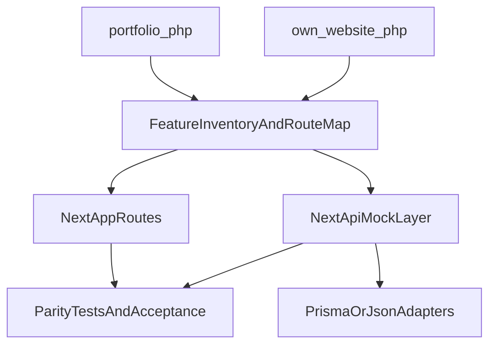

# Vollständige 1:1 Legacy-Migration

## Zielbild

Alle Funktionen aus `[l:/repos/portfolio](l:/repos/portfolio)` und `[l:/repos/own_website](l:/repos/own_website)` werden im Next.js-Projekt `[l:/repos/selcuk-karateke](l:/repos/selcuk-karateke)` vollständig nachgebildet und lauffähig gemacht (erst mit Mock-Backends, später austauschbar gegen echte Daten/Secrets).

## Migrationsarchitektur

## Phase 1: Vollständiges Audit + 1:1 Route-Mapping

- Legacy-Routen und Views vollständig erfassen aus:
    - `[l:/repos/portfolio/index.php](l:/repos/portfolio/index.php)`
    - `[l:/repos/portfolio/main.php](l:/repos/portfolio/main.php)`
    - `[l:/repos/portfolio/templates](l:/repos/portfolio/templates)`
    - `[l:/repos/portfolio/proj](l:/repos/portfolio/proj)`
    - `[l:/repos/own_website/index.php](l:/repos/own_website/index.php)`
    - `[l:/repos/own_website/proj](l:/repos/own_website/proj)`
    - `[l:/repos/own_website/exercise](l:/repos/own_website/exercise)`
- Für jede alte Route ein neues Ziel definieren (`/legacy/...` plus ggf. kanonische neue Route).
- Abnahmeliste erzeugen: „alte Funktion“ -> „neue Seite/API“ -> „Status“.

## Phase 2: Zielstruktur im Next-Projekt aufbauen

- Routenhierarchie anlegen unter `[l:/repos/selcuk-karateke/src/app](l:/repos/selcuk-karateke/src/app)`:
    - `/legacy/portfolio/...` (alle proj\_\*, exerc, educ)
    - `/legacy/own-website/...` (proj0-5, floor pages, exercises)
- Navigation erweitern in `[l:/repos/selcuk-karateke/src/components/Navbar.tsx](l:/repos/selcuk-karateke/src/components/Navbar.tsx)`.
- Landing + Systemübersicht auf `[l:/repos/selcuk-karateke/src/app/legacy/page.tsx](l:/repos/selcuk-karateke/src/app/legacy/page.tsx)` als Einstieg in alle migrierten Bereiche.

## Phase 3: Funktionsparität (Mock-First)

- APIs/Funktionen der alten PHP-Features in Next API Routes nachbauen:
    - Kontaktformular (Äquivalent zu `[l:/repos/portfolio/mail/contact_me.php](l:/repos/portfolio/mail/contact_me.php)`)
    - Login-/Session-Flows (mit NextAuth/Mock user store)
    - Livesearch-/CRUD-Endpunkte für alte Projektmodule
- Einheitliche Service-Schicht in `[l:/repos/selcuk-karateke/src/services](l:/repos/selcuk-karateke/src/services)` erweitern.
- Mock-Adapter einführen (JSON/Prisma seed), damit alle Seiten funktional sind ohne echte Secrets.

## Phase 4: UI/Content 1:1 übernehmen

- Inhalte, Seitenstruktur, Menüs und relevante Interaktionen aus den alten Seiten in React-Komponenten spiegeln.
- Alte Assets (Bilder, Downloads, Audio) in `[l:/repos/selcuk-karateke/public](l:/repos/selcuk-karateke/public)` migrieren und referenziell korrekt einbinden.
- Für jede Legacy-Route optional Redirect/Rewrite auf neue Next-Route dokumentieren.

## Phase 5: Paritätstest + Go-Live auf Coolify

- Build-/Typecheck-/Route-Smoke-Tests automatisieren.
- Funktions-Checkliste gegen Phase-1-Audit vollständig abhaken.
- Coolify-konforme Runtime prüfen (Node version, build/start command, env placeholders).
- Erst nach 100% Paritätscheck Umschaltung/Weiterleitung auf produktive Domain.

## Deliverables

- Vollständige Legacy-Routenmatrix (alt -> neu -> status)
- Lauffähige Next.js-Implementierung aller Legacy-Bereiche (Mock-first)
- Testprotokoll „funktioniert“ pro Funktion/Seite
- Deploy-Checkliste für Coolify mit klarer Umschaltreihenfolge
